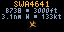

# Overhead

A [Pixlet](https://github.com/tidbyt/pixlet) app for a 64×32 Tronbyt/Tidbyt display that shows the
**single closest aircraft** to a location, using an [Airplanes.live](https://airplanes.live) feed.
One readable plane beats a cramped list. Built for personal, non-commercial use against a private
feeder — no API key required. Data from [airplanes.live](https://airplanes.live).



The frame, top to bottom:

- **Callsign** in amber (falls back to registration, then ICAO hex). Scrolls if it overflows.
- **Type · altitude** — e.g. `B738 · 37000ft`, or `GND` when on the ground.
- **Distance · bearing · speed** — e.g. `4.2nm NW · 410kt`.
- A small **plane glyph rotated to the aircraft's heading** (`track`).

If any aircraft is squawking an emergency code, it is surfaced ahead of the closest plane and flagged
(`7700 EMERG`, `7600 RADIO`, `7500 HIJACK`) with the whole frame in red.

## Configuration

| Field | Default | Notes |
|-------|---------|-------|
| **Location** | OKC metro center | Center point to search around. Set your own. |
| **Radius (nm)** | `10` | Search radius in nautical miles (clamped 1–250). |
| **Altitude units** | Feet | Feet or meters. |
| **Speed units** | Knots | Knots or MPH. **Distance follows this** — knots → `nm`, MPH → statute `mi`. |
| **Airborne only** | off | Skip aircraft on the ground. |
| **Highlight emergencies** | on | Surface any 7500/7600/7700 squawk first. |
| **Hide when no aircraft** | off | Skip the app in rotation (render nothing) when no aircraft are in range. |

The app fetches `https://api.airplanes.live/v2/point/{lat}/{lon}/{radius}` with a 45-second cache TTL,
so device refreshes stay well under the API's 1 request/second limit. Records with a stale position
(>60s) are dropped. On a non-200 response it shows `NO SIGNAL`; with no aircraft in range, `NO AIRCRAFT`
(or nothing at all, if **Hide when no aircraft** is on).

## Preview locally

```sh
# Live, interactive preview (configure fields in the browser):
pixlet serve overhead.star

# Render a single frame to a WebP:
pixlet render overhead.star && open overhead.webp

# Render with config (location is a JSON string; flags are key=value):
pixlet render overhead.star \
  location='{"lat":"35.47","lng":"-97.52"}' \
  radius=15 speed_units=mph only_airborne=true \
  -o preview.webp

# Validate before installing:
pixlet check overhead.star
```

## Install into Tronbyt

Drop `overhead.star` and `manifest.yaml` into your Tronbyt server's community-apps directory (the
same layout Tidbyt community apps use), then add **Overhead** to a device and configure it. Tronbyt
serves the same Pixlet render/schema/http API, so no changes are needed.

## Data source & terms

Aircraft data is provided by [airplanes.live](https://airplanes.live) via its public
[REST API](https://airplanes.live/api-guide/). This app is an independent project and is
not affiliated with or endorsed by airplanes.live.

By using this app you agree to the airplanes.live [API terms of use](https://airplanes.live/api-guide/):

- **Personal, non-commercial, educational use only.** For commercial use, see their
  [commercial data options](https://airplanes.live/commercial-use/).
- **Max 1 request/second.** This app enforces that with a 45-second cache TTL — do not
  lower `TTL_SECONDS` below 30.
- The API is provided with **no SLA and no uptime guarantee**.

airplanes.live is a community-funded network of volunteer feeders. If you rely on this
data, please [support them](https://airplanes.live/donate/).

## v2 ideas (out of scope)

- Multiple aircraft / a scrolling list
- A mini map or position trails
- Push alerts on emergency squawks or specific types/registrations
